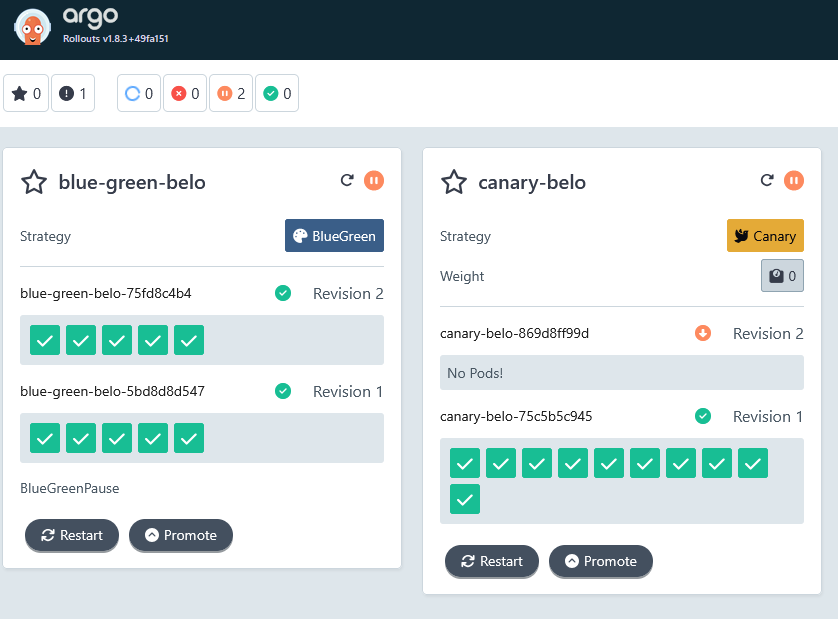
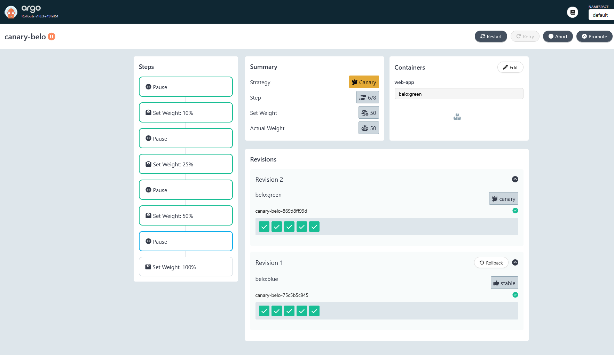
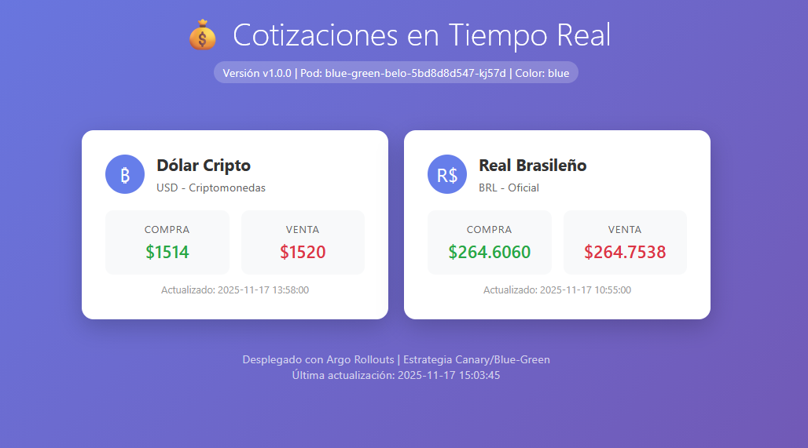
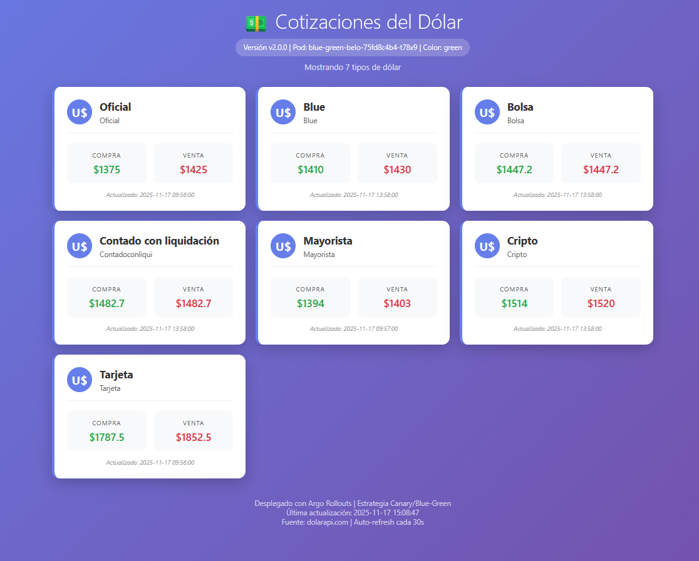

# Kubernetes Deployment Strategies

## 📋 Overview

This project demonstrates modern Kubernetes deployment strategies using **Argo Rollouts**. It provides a practical implementation of **Blue/Green** and **Canary** deployments in a local Kubernetes environment with comprehensive load testing and automation.

## 🎯 Features

- ✅ **Blue/Green Deployments** with manual promotion and preview testing
- ✅ **Canary Deployments** with progressive traffic shifting
- ✅ **Load Testing** with k6 for performance validation
- ✅ **Request Logging** to stdout with version identification
- ✅ **Automated Scripts** for easy management and testing
- ✅ **Health Checks** with liveness and readiness probes

## 🏗️ Architecture

```
k8s-deployment-strategies/
├── apps/                          # Application Code for Blue/Green deployments
│   ├── blue-app/                  # Blue version application
│   │   ├── templates/
│   │   │   └── index.html         # HTML template for blue version
│   │   ├── app.py                 # Flask application
│   │   ├── Dockerfile             # Container image definition
│   │   └── requirements.txt       # Python dependencies
│   └── green-app/                 # Green version application
│       ├── templates/
│       │   └── index.html         # HTML template for green version
│       ├── app.py                 # Flask application
│       ├── Dockerfile             # Container image definition
│       └── requirements.txt       # Python dependencies
├── load-test/                     # Load Testing Scripts
│   ├── blue-green-test.js         # Blue/Green deployment validation tests
│   └── canary-test.js             # Canary deployment progressive testing
├── manifests/                     # Kubernetes Manifests
│   ├── blue-green/                # Blue/Green deployment resources
│   │   ├── rollout.yaml           # Argo Rollout configuration for Blue/Green
│   │   ├── service-active.yaml    # Service pointing to active version
│   │   └── service-preview.yaml   # Service for preview/testing version
│   └── canary/                    # Canary deployment resources
│       ├── rollout.yaml           # Argo Rollout for Canary with traffic splitting
│       ├── service-canary.yaml    # Service for canary version
│       ├── service-stable.yaml    # Service for stable version
│       └── service.yaml           # Main service for canary deployment
├── scripts/                       # Automation and Management Scripts
│   ├── setup.sh                   # Initial cluster setup and dependencies
│   ├── install-argo-rollouts.sh   # Argo Rollouts installation
│   ├── build-images.sh            # Docker image builder for both versions
│   ├── deploy-blue-green.sh       # Blue/Green deployment automation
│   ├── deploy-canary.sh           # Canary deployment automation
│   ├── run-k6-tests.sh            # Load testing execution
│   └── nuke-everything.sh         # Complete environment cleanup
├── dashboard.png                  # ExampleArgo1 dashboard
├── deploy.png                     # ExampleArgo2 a canary deployment
├── devops-challenge-belo.pdf      # Pdf with requirements
├── page.png                       # Page1
├── page2.png                      # Page2
└── README.md                      # Project documentation and guide
```

## 📋 Prerequisites

- **Ubuntu 24.04** it works with WSL as well
    - For WSL Usage: When Git on Windows clones a repository, it automatically converts line endings to CRLF
        ```bash
        cd k8s-deployment-strategies/
        sudo apt update
        sudo apt install dos2unix
        find . -type f -name "*.sh" -exec dos2unix {} \;
        ```
- **Kubernetes Cluster**
- **kubectl** configured to access your cluster (minikube v1.37.0)
- **Docker** for building images (Docker Desktop v4.51.0 or docker.io)
- **curl** for testing endpoints

## 🚀 Quick Start

### 1. Clone and Setup

```bash
git clone https://github.com/thiagobrucezzi/k8s-deployment-strategies
cd k8s-deployment-strategies

# Setup cluster and install dependencies
./scripts/setup.sh

# Install Argo Rollouts
./scripts/install-argo-rollouts.sh
Requires sudo. If you want to view the dashboard, leave this session open and continue with the following commands in a new one. http://localhost:3100/rollouts
```




### 2. Build Application Images

```bash
# Build both blue and green versions
./scripts/build-images.sh
```

### 3. Deploy Both Strategies

```bash
# Deploy Blue/Green
./scripts/deploy-blue-green.sh

# Deploy Canary
./scripts/deploy-canary.sh
```

### 4. Verify Deployments

```bash
# Check rollout status
kubectl argo rollouts get rollout blue-green-belo
kubectl argo rollouts get rollout canary-belo

# List all services
kubectl get svc
```

## 🛠️ Detailed Usage

### Blue/Green Deployment

**Workflow:**
1. **Initial State**: Active service points to Blue version
2. **New Deployment**: Preview service gets Green version
3. **Testing**: Validate Green version via preview service
4. **Promotion**: Switch active service to Green version

**Management Commands:**
```bash
# Check status
kubectl argo rollouts get rollout blue-green-belo

# Deploy new version (creates Green)
kubectl argo rollouts set image blue-green-belo web-app=belo:green

# Promote to production
kubectl argo rollouts promote blue-green-belo
```

**Testing Blue-Green Traffic:**
```bash
# Test active service (production)
kubectl port-forward svc/blue-green-active 8080:80
curl http://localhost:8080/version

# Test preview service (new version)
kubectl port-forward svc/blue-green-preview 8081:80
curl http://localhost:8081/version
```

### Canary Deployment

**Workflow:**
1. **Initial Rollout**: Waiting for a manual promote to start
2. **Progressive Increase**: 0% → 10% → 25% → 50% → 75% → 100%
3. **Automatic Pauses**: Validation at each step
4. **Manual Promotion**: Control progression speed

**Management Commands:**
```bash
# Check status
kubectl argo rollouts get rollout canary-belo

# Update to new version
kubectl argo rollouts set image canary-belo web-app=belo:green

# Promote to nexts steps
kubectl argo rollouts promote canary-belo
```

**Testing Canary Traffic:**
```bash
# Test active service (production)
kubectl port-forward svc/canary-stable 8080:80
curl http://localhost:8080/version

# Test preview service (new version)
kubectl port-forward svc/canary-canary 8081:80
curl http://localhost:8081/version

# Test service (User view)
kubectl port-forward svc/service-canary 8082:80
curl http://localhost:8082/version

# For accurate traffic distribution testing, use internal cluster access:
# This is what users would “see.” As the green version is promoted, traffic will be redirected to different pods. And depending on the migration percentage, more or fewer users will see the new version.
kubectl run -it --rm test --image=curlimages/curl --     sh -c 'for i in $(seq 1 20); do curl -s http://service-canary/api; sleep 1; done'
```

**After execute commands you will able to see both versions, stable - active & preview - canary**





## 🧪 Load Testing

### Run All Tests
```bash
./scripts/run-k6-tests.sh
```

### Individual Tests
```bash
# Test all canary components (canary, stable, and balancer)
kubectl run k6-canary --image=grafana/k6 --rm -i -- \
    run - < load-test/canary-test.js

# Test Blue/Green deployment
kubectl run k6-blue-green --image=grafana/k6 --rm -i -- \
    run - < load-test/blue-green-test.js

# If you have issues with k6 pod - delete and execute again -
kubectl delete pod k6-canary k6-blue-green
```

## Test Architecture

### Canary Deployment Tests
- **`canary-belo`** - Main load balancer (production traffic)
- **`canary-canary`** - New version (canary)
- **`canary-stable`** - Stable version (current production)

### Blue-Green Deployment Tests
- **`blue-green-active`** - Active production environment
- **`blue-green-preview`** - Preview/staging environment

## Test Features

### 🎯 Load Patterns
- **Staged Load Testing**: Ramp up, sustain peak, ramp down
- **Realistic Traffic**: Simulates real user behavior patterns
- **Performance Benchmarking**: Comparison between versions

### 📊 Performance Thresholds
- 95th percentile response time < 2000ms
- 99th percentile response time < 3000ms
- Error rate < 10%
- Individual service response time monitoring

### 🔍 Validation Checks
- **Content Type Detection**: Automatic JSON/HTML handling
- **Version Validation**: Color and version extraction from both JSON and HTML
- **Health Monitoring**: Status codes, response structure, error detection
- **Deployment Verification**: Version differences during deployments

### 📈 Custom Metrics
- Response times per service
- Error rates and success tracking
- Traffic distribution analysis
- Performance comparison between versions
- HTML content parsing and validation

## 📊 Monitoring and Verification

### Check Rollout Status
```bash
# Watch rollout progress
kubectl argo rollouts get rollout canary-belo --watch
kubectl argo rollouts get rollout blue-green-belo --watch

# Detailed rollout information
kubectl describe rollout canary-belo
kubectl describe rollout blue-green-belo
```

### Verify Service Endpoints
```bash
# Check service endpoints
kubectl get endpoints canary-stable
kubectl get endpoints canary-canary
kubectl get endpoints service-canary
kubectl get endpoints blue-green-active
kubectl get endpoints blue-green-preview
```

## 🔧 Advanced Operations

### Restart Rollouts
```bash
# Restart Canary rollout
kubectl argo rollouts restart canary-belo

# Restart Blue/Green rollout
kubectl argo rollouts restart blue-green-belo
```

### Rollback Operations
```bash
# Rollback Canary to previous version
kubectl argo rollouts undo canary-belo

# Rollback Blue/Green to previous version
kubectl argo rollouts undo blue-green-belo
```

## 🗑️ Cleanup

### Remove All Resources
```bash
# Complete cleanup
./scripts/nuke-everything.sh
```

### Selective Cleanup
```bash
# Remove specific deployments
kubectl delete rollout blue-green-belo
kubectl delete rollout canary-belo
kubectl delete svc blue-green-preview
kubectl delete svc blue-green-active
kubectl delete svc canary-canary
kubectl delete svc canary-stable
kubectl delete svc service-canary

# Remove Argo Rollouts
kubectl delete namespace argo-rollouts
```

## 🎯 Strategy Comparison

| Aspect | Blue/Green | Canary |
|--------|------------|---------|
| **Traffic Shift** | Instant 100% | Gradual (10% → 100%) |
| **Risk** | Higher (all-or-nothing) | Lower (progressive) |
| **Rollback** | Instant switch | Gradual or instant |
| **Resource Usage** | 2x during transition | Incremental |
| **Testing** | Preview environment | Production traffic sampling |
| **Best For** | Major versions, database changes | Feature rollouts, risk mitigation |


## 🙏 Acknowledgments

- [Argo Rollouts](https://argoproj.github.io/rollouts/) for advanced deployment capabilities
- [k6](https://k6.io/) for load testing infrastructure
- Kubernetes community for excellent documentation
- [minikube](https://minikube.sigs.k8s.io/docs/)

## 🚀 Future Enhancements & Roadmap

### Proposed Improvements - On a possible new Ver

**GitOps Implementation with ArgoCD**
- Implement **ArgoCD** for declarative, GitOps-based continuous delivery
- Synchronize deployment state automatically with Git repositories
- Enable automated environment synchronization and rollback capabilities
- Provide a unified dashboard for monitoring application deployments

**Advanced Configuration Management with Kustomize**
- Integrate **Kustomize** for efficient Kubernetes manifest customization
- Implement environment-specific overlays (dev, staging, production)
- Streamline configuration versioning and management
- Leverage native compatibility with ArgoCD for seamless deployments

**Enhanced Observability with Prometheus & Grafana**
- Integrate **Prometheus** for centralized metric collection across all Kubernetes workloads
- Implement **Grafana dashboards** to visualize application performance, traffic distribution, and system health in real time
- Monitor **load-testing results (k6)**, including latency, throughput, error rates, and canary/stable traffic split
- Establish alerting rules for critical performance thresholds (e.g., high latency, elevated error rates, abnormal traffic routing)
- Enable deeper analysis of deployment strategies (Canary / Blue-Green) using time-series metrics and per-pod insights
- Provide developers and operators with actionable observability to validate rollout behavior and ensure stable production releases

### Expected Benefits ✅

- **True GitOps Workflow**: Git as the single source of truth for both application and infrastructure code
- **Enhanced Collaboration**: Development and Ops teams work from unified Git repositories
- **Simplified Rollbacks**: Quick revert to previous states using Git history
- **Environment Consistency**: Identical deployment processes across all environments
- **Reduced Configuration Drift**: Automated synchronization prevents manual changes
- **Improved Visibility & Diagnostics:** Prometheus and Grafana provide real-time metrics for rollout behavior, service health, and traffic distribution
- **Data-Driven Release Validation:** Canary and Blue-Green deployments can be validated using concrete performance metrics (latency, throughput, error rates)
- **Faster Issue Detection:** Alerts and dashboards surface anomalies early, reducing MTTR (Mean Time to Recovery)

### Technical Integration

```
                     Git Repository
                           │
                           ▼
                 ArgoCD (GitOps Controller)
                           │
                           ▼
              Kustomize (Manifest Customization)
                           │
                           ▼
        Argo Rollouts (Progressive Delivery Engine)
                           │
                           ▼
                    Kubernetes Cluster
                           │
           ┌───────────────┴────────────────┐
           │                                │
           ▼                                ▼
Application Pods                  Metrics Exporters
(Blue/Green, Canary)    (Pod / Node / Rollout Metrics)
                                            │
                                            ▼
                                Prometheus (Metrics Collection)
                                            │
                                            ▼
                         Grafana (Dashboards & Traffic Visualization)
```

---
## Thanks a lot for read and try all! Happy Deploying! 🚀
*Cheers Thiago!*
